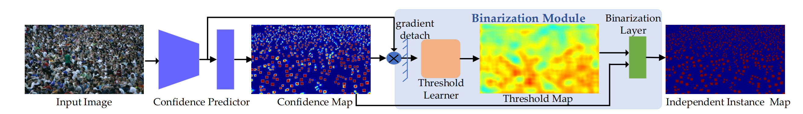
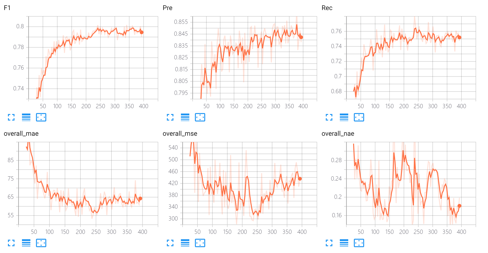
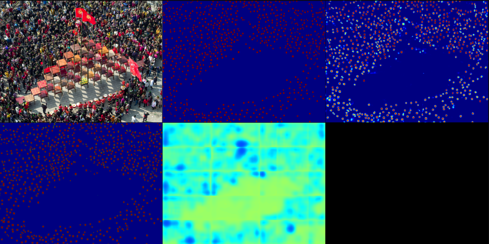
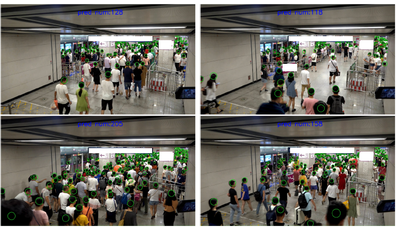

# IIM - Crowd Localization

---

This repo is the official implementation of [paper](https://arxiv.org/abs/2012.04164): **Learning Independent Instance Maps for Crowd Localization**. The code is developed based on [C3F](https://github.com/gjy3035/C-3-Framework). 


# Progress
- [x] Testing Code (2020.12.10)
- [x] Training Code 
  - [x] NWPU (2020.12.14)
  - [x] JHU (2021.01.05)
  - [x] UCF-QNRF (2020.12.30)
  - [x] ShanghaiTech Part A/B (2020.12.29)
  - [x] FDST (2020.12.30)
- [x] scale information for UCF-QNRF and ShanghaiTech Part A/B (2021.01.07)


# Getting Started


## Preparation
-  Prerequisites
    - Python 3.7
    - Pytorch 1.6: http://pytorch.org .
    - other libs in ```requirements.txt```, run ```pip install -r requirements.txt```.
-  Code
    - Clone this repo in the directory (```Root/IIM```):
    - Download the pre-trained HR models from this [link](https://onedrive.live.com/?authkey=%21AKvqI6pBZlifgJk&cid=F7FD0B7F26543CEB&id=F7FD0B7F26543CEB%21116&parId=F7FD0B7F26543CEB%21105&action=locate). More details are availble at [HRNet-Semantic-Segmentation](https://github.com/HRNet/HRNet-Semantic-Segmentation) and  [HRNet-Image-Classification](https://github.com/HRNet/HRNet-Image-Classification).
 
- Datasets
 
    - Download NWPU-Crowd dataset from this [link](https://www.crowdbenchmark.com/nwpucrowd.html). 
    - Unzip ```*zip``` files in turns and place ```images_part*``` into the same folder (```Root/ProcessedData/NWPU/images```). 
    - Download the processing labels and val gt file from this _[link](https://mailnwpueducn-my.sharepoint.com/:f:/g/personal/gjy3035_mail_nwpu_edu_cn/EliCeOckaZVBgez6n8ZWvr4BNdwPauFJgbm88MGhHid25w?e=rtogwc)_. Place them into ```Root/ProcessedData/NWPU/masks``` and ```Root/ProcessedData/NWPU```, respectively.
 
    - If you want to reproduce the results on Shanghai Tech Part A/B , UCF-QNRF, and JHU datasets, you can follow the instructions in [DATA.md](datasets/dataset_prepare/DATA.md) to setup the datasets.
  
  - Finally, the folder tree is below:
 ```
    -- ProcessedData
		|-- NWPU
			|-- images
			|   |-- 0001.jpg
			|   |-- 0002.jpg
			|   |-- ...
			|   |-- 5109.jpg
			|-- masks
			|   |-- 0001.png
			|   |-- 0002.png
			|   |-- ...
			|   |-- 3609.png
			|-- train.txt
			|-- val.txt
			|-- test.txt
			|-- val_gt_loc.txt
	-- PretrainedModels
	  |-- hrnetv2_w48_imagenet_pretrained.pth
	-- IIM
	  |-- datasets
	  |-- misc
	  |-- ...
 ```

## Training
- run ```python train.py```.
- run ```tensorboard --logdir=exp --port=6006```.
- The validtion records are shown as follows:
   
- The sub images are the input image, GT, prediction map,localization result, and pixel-level threshold, respectively:
   
   
Tips: The training process takes **~50 hours** on NWPU datasets with **two TITAN RTX (48GB Memory)**. 


## Testing and Submitting

- Modify some key parameters in ```test.py```: 
  - ```netName```.  
  -  ```model_path```.  
- Run ```python test.py```. Then the output file (```*_*_test.txt```) will be generated, which can be directly submitted to [CrowdBenchmark](https://www.crowdbenchmark.com/nwpucrowdloc.html)

## Visualization on the val set
- Modify some key parameters in ```test.py```: 
  - ```test_list = 'val.txt'```
  - ```netName```.  
  -  ```model_path```.  
- Run ```python test.py```. Then the output file (```*_*_val.txt```) will be generated.
- Modify some key parameters in ```vis4val.py```: 
  - ```pred_file```.  
- Run  ```python vis4val.py```. 

# Performance

The results (F1, Pre., Rec. under the `sigma_l`) and [pre-trained models](https://mailnwpueducn-my.sharepoint.com/:f:/g/personal/gjy3035_mail_nwpu_edu_cn/EliCeOckaZVBgez6n8ZWvr4BNdwPauFJgbm88MGhHid25w?e=rtogwc) on NWPU val set, UCF-QNRF, SHT A, SHT B, and FDST:

|   Method   |  NWPU val  |  UCF-QNRF  |  SHT A  | 
|------------|-------|-------|--------|
| Paper:  VGG+FPN [2,3]| 77.0/80.2/74.1 | **68.8**/78.2/61.5 | **72.5**/72.6/72.5 | 
| This Repo's Reproduction:  VGG+FPN [2,3]| **77.1**/82.5/72.3| 67.8/75.7/61.5 | 71.6/75.9/67.8 |  
| Paper:  HRNet [1]   | **80.2**/84.1/76.6| **72.0**/79.3/65.9 |  73.9/79.8/68.7  | 
| This Repo's Reproduction:  HRNet [1]   | 79.8/83.4/76.5 |  **72.0**/78.7/66.4  | **76.1**/79.1/73.3 |

|   Method   |  SHT B  |  FDST |  JHU  |
|------------|---------|-------|-------|
| Paper:  VGG+FPN [2,3]|   80.2/84.9/76.0  | 93.1/92.7/93.5 | - |
| This Repo's Reproduction:  VGG+FPN [2,3] |  **81.7**/88.5/75.9 | **93.9**/94.7/93.1| 61.8/73.2/53.5 |
| Paper:  HRNet [1]   | **86.2**/90.7/82.1  |  95.5/95.3/95.8  | 62.5/74.0/54.2 |
| This Repo's Reproduction:  HRNet [1]   | 86.0/91.5/81.0 | **95.7**/96.9 /94.4 | **64.0**/73.3/56.8 |

**References**
1. Deep High-Resolution Representation Learning for Visual Recognition, T-PAMI, 2019.
2. Very Deep Convolutional Networks for Large-scale Image Recognition, arXiv, 2014.
3. Feature Pyramid Networks for Object Detection, CVPR, 2017. 

About the leaderboard on the test set, please visit [Crowd benchmark](https://www.crowdbenchmark.com/nwpucrowdloc.html).  Our submissions are the [IIM(HRNet)](https://www.crowdbenchmark.com/resultldetail.html?rid=11) and [IIM (VGG16)](https://www.crowdbenchmark.com/resultldetail.html?rid=10).


# Video Demo

We test the pretrained HR Net model on the NWPU dataset in a real-world subway scene. Please visit [bilibili](https://www.bilibili.com/video/BV1K541157MK) or [YouTube](https://www.youtube.com/watch?v=GqOMgjUkbsI) to watch the video demonstration.

# Citation
If you find this project is useful for your research, please cite:
```
@article{gao2020learning,
  title={Learning Independent Instance Maps for Crowd Localization},
  author={Gao, Junyu and Han, Tao and Yuan, Yuan and Wang, Qi},
  journal={arXiv preprint arXiv:2012.04164},
  year={2020}
}
```

Our code borrows a lot from the C^3 Framework, and you may cite:
```
@article{gao2019c,
  title={C$^3$ Framework: An Open-source PyTorch Code for Crowd Counting},
  author={Gao, Junyu and Lin, Wei and Zhao, Bin and Wang, Dong and Gao, Chenyu and Wen, Jun},
  journal={arXiv preprint arXiv:1907.02724},
  year={2019}
}
```
If you use pre-trained models in this repo (HR Net, VGG, and FPN), please cite them. 


